# DuckDB gRPC Server — Architecture Document

## Table of Contents

1. [Overview](#overview)
2. [Use Cases](#use-cases)
3. [System Architecture](#system-architecture)
4. [Class Diagrams](#class-diagrams)
5. [Sequence Diagrams](#sequence-diagrams)
6. [Component Details](#component-details)
7. [Protocol Design](#protocol-design)
8. [Performance Architecture](#performance-architecture)
9. [Deployment](#deployment)

---

## Overview

Three server implementations (C#, C++, Rust) expose DuckDB over gRPC using a custom
columnar protocol defined in `proto/duckdb_service.proto`. All servers are fully
interoperable — any client generated from the proto can talk to any server.

### Design Goals

- **Sub-millisecond cached queries** — LRU cache bypasses DuckDB entirely on hit
- **Linear read scaling** — N shards = N× read throughput via round-robin
- **Write consistency** — Fan-out writes to ALL shards keep data identical
- **VS2017 / .NET 4.6.2 compatibility** — C# server and client target legacy framework
- **Zero-copy where possible** — C++ memcpy from DuckDB buffers, Rust query_arrow()

---

## Use Cases

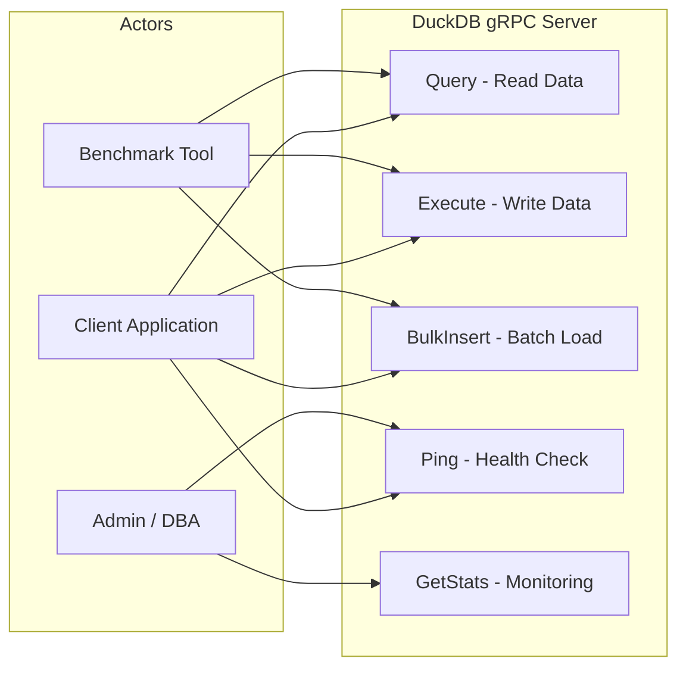

### Use Case Descriptions

| Use Case | Actor | Description | Protocol |
|----------|-------|-------------|----------|
| **Query** | Client | Execute SQL SELECT, receive columnar streaming results | Server-streaming RPC |
| **Execute** | Client | Execute DML/DDL (INSERT, CREATE TABLE, etc.) | Unary RPC |
| **BulkInsert** | Client | Send columnar data for fast batch insertion | Unary RPC |
| **Ping** | Client/Admin | Health check, returns "pong" | Unary RPC |
| **GetStats** | Admin | Server metrics (reads, writes, errors, pool size) | Unary RPC |

---

## System Architecture

### High-Level Architecture

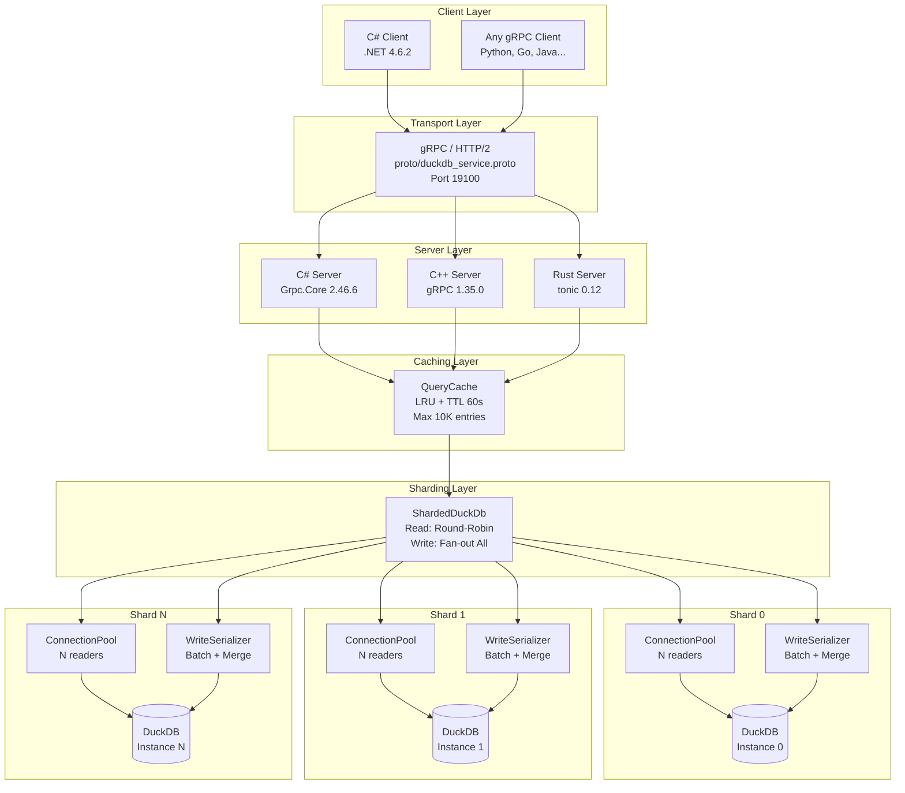

### Request Flow

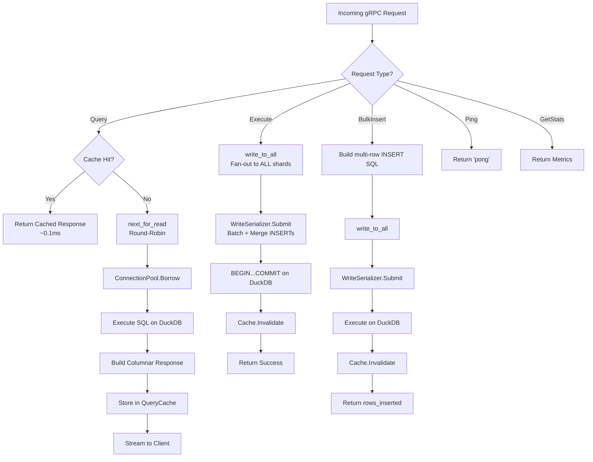

---

## Class Diagrams

### C# Server Class Diagram

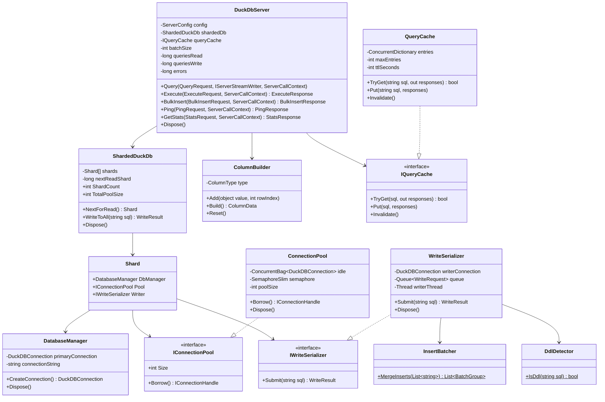

### C++ Server Class Diagram

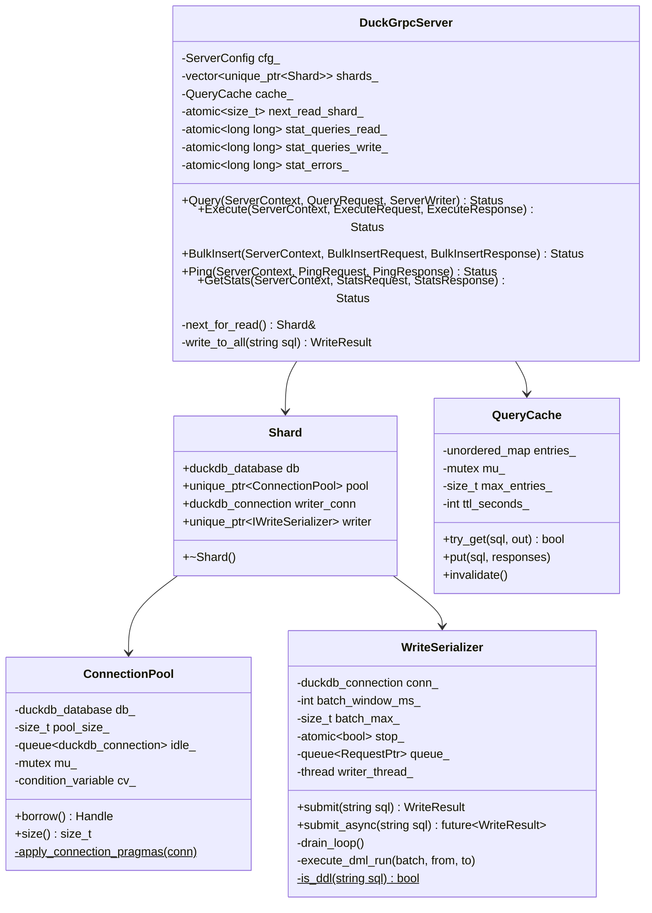

### Rust Server Class Diagram

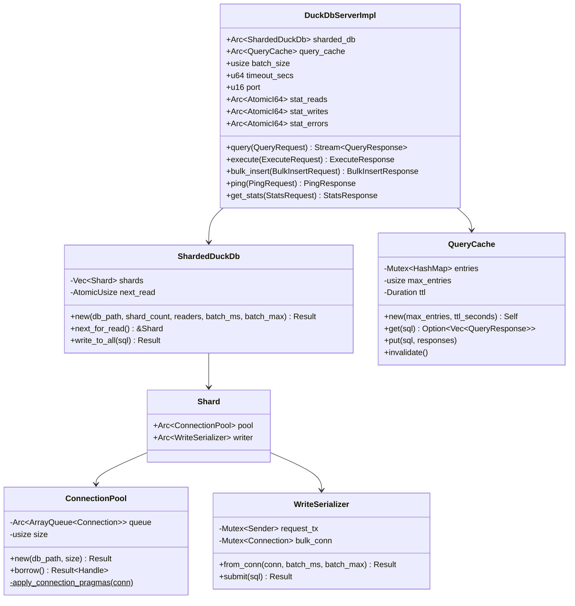

---

## Sequence Diagrams

### Query (Cache Miss)

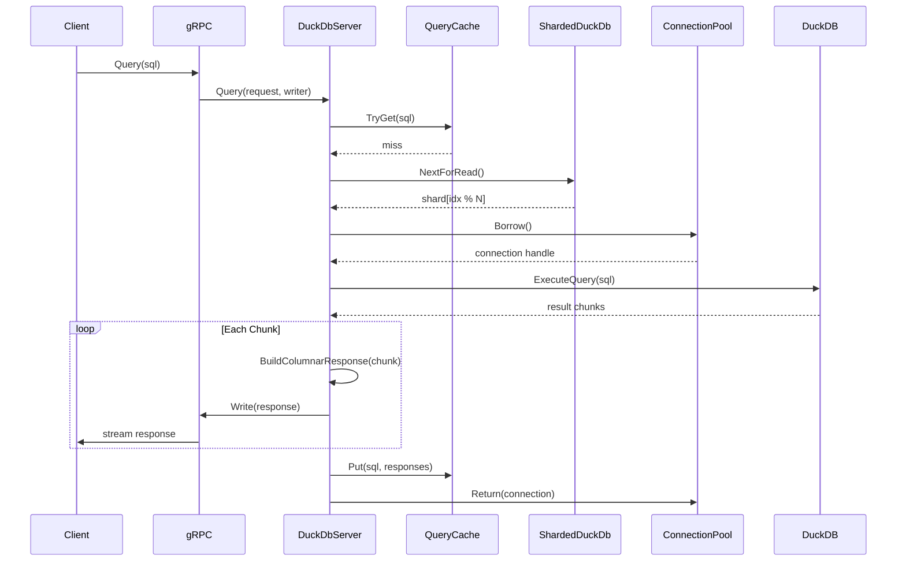

### Query (Cache Hit)

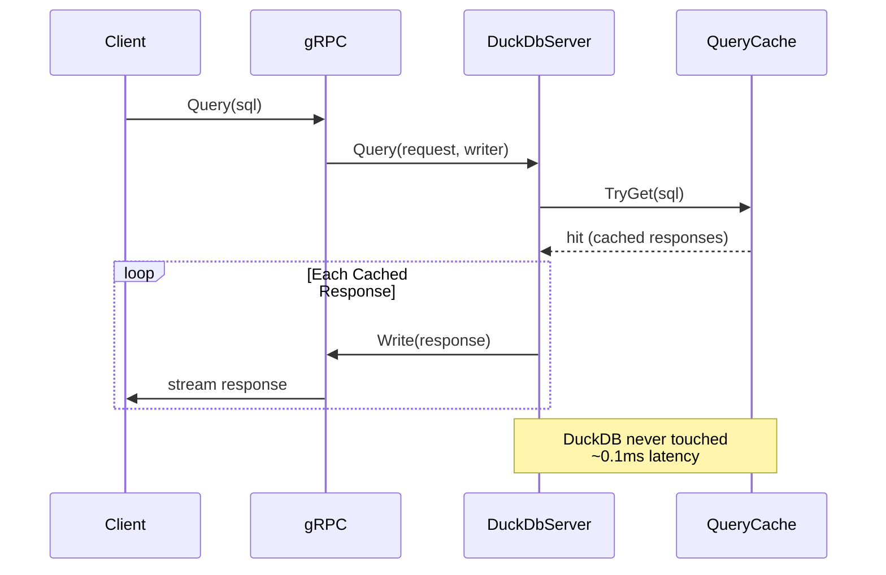

### Execute (Write with Fan-out)

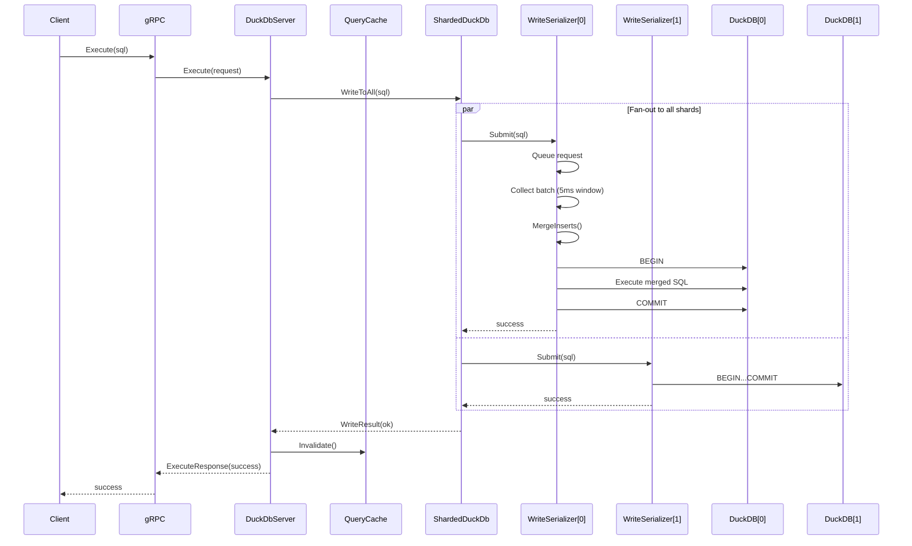

### Write Batching (WriteSerializer Internal)

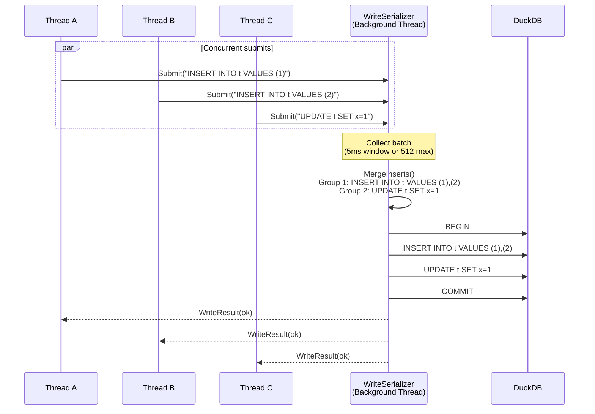

### BulkInsert

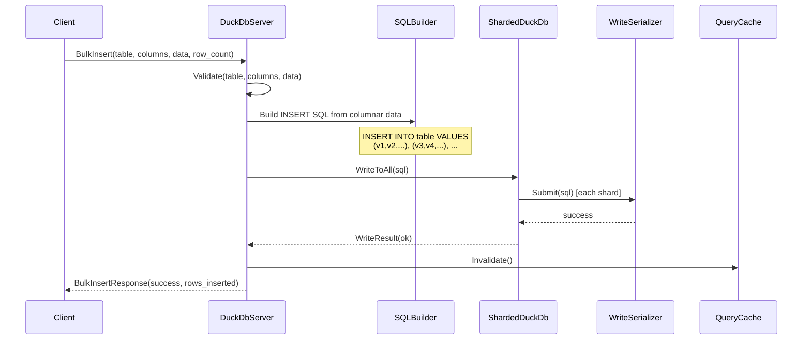

---

## Component Details

### Sharding Strategy: Read-All / Write-All

```
Write fan-out:              Read round-robin:
  Client writes "X"           Client reads
       │                          │
  ┌────┴────┐              ┌─────┴─────┐
  ▼    ▼    ▼              ▼           ▼
┌───┐┌───┐┌───┐         ┌───┐       ┌───┐
│S0 ││S1 ││S2 │         │S0 │  next  │S1 │  next ...
│ X ││ X ││ X │         │   │──────► │   │──────►
└───┘└───┘└───┘         └───┘       └───┘
All shards identical     Round-robin distribution
```

- **Reads**: Atomic counter `idx++ % N` distributes queries evenly
- **Writes**: Every shard executes the same write (data stays consistent)
- **Trade-off**: Write throughput = single shard speed; read throughput = N × single shard
- **Memory databases**: Each shard is independent `:memory:` instance
- **File databases**: Each shard uses `dbname_0.db`, `dbname_1.db`, etc.

### Connection Pool

| Language | Data Structure | Blocking Strategy | Timeout |
|----------|---------------|-------------------|---------|
| C# | ConcurrentBag + SemaphoreSlim | User-mode semaphore wait | 10s |
| C++ | std::queue + mutex + condition_variable | cv.wait_until | 10s |
| Rust | crossbeam::ArrayQueue | Spin + yield_now | 10s |

### Write Serialization Pipeline

```
Submit() ──► Queue ──► CollectBatch ──► ClassifyDDL ──► MergeINSERTs ──► Transaction
                       (5ms window)     (DDL alone)    (multi-row)      (BEGIN..COMMIT)
                       (max 512)                                         │
                                                                    Failure?
                                                                    ──► ROLLBACK
                                                                    ──► Retry individually
```

### Query Cache

- **Storage**: ConcurrentDictionary (C#), Mutex<HashMap> (Rust), mutex + unordered_map (C++)
- **Key**: Raw SQL string
- **Value**: List/Vec of serialized QueryResponse protobuf messages
- **TTL**: 60 seconds (configurable)
- **Max entries**: 10,000
- **Eviction**: Passive — expired entries removed on capacity check
- **Invalidation**: Full clear on any write (Execute or BulkInsert)

---

## Protocol Design

### Columnar Encoding

```
Row format (traditional):      Columnar format (this project):
┌─────────────────────┐        ┌──────────────────────────┐
│ Row 0: {id:1, x:10} │        │ Column "id": [1, 2, 3]  │  ← packed int32
│ Row 1: {id:2, x:20} │        │ Column "x":  [10,20,30] │  ← packed int32
│ Row 2: {id:3, x:30} │        │ null_indices: []         │
└─────────────────────┘        └──────────────────────────┘
11,000 objects (1000×10+1000)   10 objects (10 columns)
```

### Type Mapping

| DuckDB Type | Proto ColumnType | Proto Field | Size |
|-------------|-----------------|-------------|------|
| BOOLEAN | TYPE_BOOLEAN | bool_values | 1 byte |
| TINYINT | TYPE_INT8 | int32_values | widened to 4B |
| SMALLINT | TYPE_INT16 | int32_values | widened to 4B |
| INTEGER | TYPE_INT32 | int32_values | 4 bytes |
| BIGINT | TYPE_INT64 | int64_values | 8 bytes |
| UTINYINT | TYPE_UINT8 | int32_values | widened to 4B |
| USMALLINT | TYPE_UINT16 | int32_values | widened to 4B |
| UINTEGER | TYPE_UINT32 | int64_values | widened to 8B |
| UBIGINT | TYPE_UINT64 | int64_values | 8 bytes |
| FLOAT | TYPE_FLOAT | float_values | 4 bytes |
| DOUBLE | TYPE_DOUBLE | double_values | 8 bytes |
| VARCHAR | TYPE_STRING | string_values | variable |
| BLOB | TYPE_BLOB | blob_values | variable |
| DECIMAL | TYPE_DECIMAL | double_values | lossy to 8B |

---

## Performance Architecture

### DuckDB Tuning (per connection)

| Setting | Value | Rationale |
|---------|-------|-----------|
| `threads=1` | 1 thread per connection | Pool provides parallelism; avoids internal contention |
| `preserve_insertion_order=false` | Disabled | 1.5-3× faster scans without ORDER BY |
| `enable_object_cache` | Enabled | Caches Parquet/table metadata |
| `checkpoint_threshold` | 256MB | Reduces checkpoint frequency (default 16MB) |
| `memory_limit` | auto: 80%/N shards | Prevents N shards each claiming 80% RAM → OOM |
| `late_materialization_max_rows` | 1000 | Faster ORDER BY...LIMIT for pagination (default 50) |
| `allocator_flush_threshold` | 128MB | Reduces OS memory return overhead |
| `temp_directory` | configurable | Fast NVMe path for spill-to-disk |

### C++ Protobuf Arena Allocation

The C++ Query handler uses `google::protobuf::Arena` to allocate per-chunk
`QueryResponse` messages. This reduces malloc/free overhead by 40-60% for
large result sets with many chunks. The arena is created per-chunk and
destroyed automatically when the chunk is done processing.

### gRPC Tuning

| Parameter | Value | Purpose |
|-----------|-------|---------|
| Max concurrent streams | 200 | HTTP/2 multiplexing limit |
| Max message size | 64MB | Large result support |
| HTTP/2 write buffer | 2MB | Batches small writes |
| Keepalive interval | 30s | Detects dead connections |
| Keepalive timeout | 10s | Grace period before disconnect |
| BDP probe | Enabled | Auto-tunes TCP window |

### C# Server GC

```xml
<!-- App.config -->
<gcServer enabled="true"/>      <!-- One GC heap per CPU core -->
<gcConcurrent enabled="true"/>  <!-- Background Gen2 collection -->
```

---

## Deployment

### Command-Line Flags

| Flag | Default | Description |
|------|---------|-------------|
| `--db` | `:memory:` | DuckDB file path or `:memory:` |
| `--host` | `0.0.0.0` | Bind address |
| `--port` | `19100` | gRPC listen port |
| `--shards` | `1` | Number of DuckDB instances |
| `--readers` | `nCPU×2` | Total read connection pool |
| `--batch-ms` | `5` | Write batch window (ms) |
| `--batch-max` | `512` | Max writes per batch |
| `--batch-size` | `8192` | Rows per streaming response |
| `--memory-limit` | auto | DuckDB memory limit (auto: 80%/shards, or e.g. "8GB") |
| `--threads` | `1` | DuckDB threads per connection |
| `--timeout` | `30` | Query timeout (seconds, C# only) |
| `--backup-db` | — | Hybrid mode: file DB for durable backup + memory reads |
| `--temp-dir` | — | Temp directory for DuckDB spill-to-disk |
| `--tls-cert` | — | TLS certificate PEM path |
| `--tls-key` | — | TLS private key PEM path |

### Recommended Production Configuration

```bash
# High-throughput read-heavy workload (8-core machine)
--shards 8 --readers 128 --batch-ms 1 --batch-max 64 --memory-limit 8GB

# Hybrid mode: durable file backup + fast memory reads (5-10x)
--backup-db data.duckdb --shards 4 --readers 64 --memory-limit 8GB

# Write-heavy workload
--shards 2 --readers 32 --batch-ms 5 --batch-max 512

# Single-user development
--shards 1 --readers 4
```
